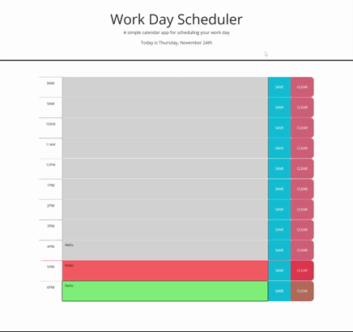

# Module 5 Challenge

## Objective:
* Complete a daily planner from the starter code.
* The current day will be displayed at the top of the calendar.
* Time blocks that showing standard business hours will be displayed in the main body.
* The time blocks needed to be color-themed to indicate whether it is in the past, present, or future.
* Each time block must has a text area to enter an event.
* Each time block must has a save button that can save text for that event in local storage.
* The saved text has to persist when the user refreshes the page.

## The Outcome:
* All the objectives are accomplished. You can see all the features in the demo.

 

 
 
 

## Extra features were added to make the app work better
* A clear button was added to delete saved text from local storage. It will only function when some text were saved in local storage. See the demo above for example.

* The color theme will change cooresponding to the live time to make "past, present, future" more accurate.

 

 
 
 

## Installation

The project was uploaded to a [github](https://github.com/) repository. You can get access from [here](https://github.com/RicenUdonLover/Module5_Challenge_Lian_Liu.git).
 
You can also see the deployed webpage [over here](https://ricenudonlover.github.io/Module5_Challenge_Lian_Liu/).
